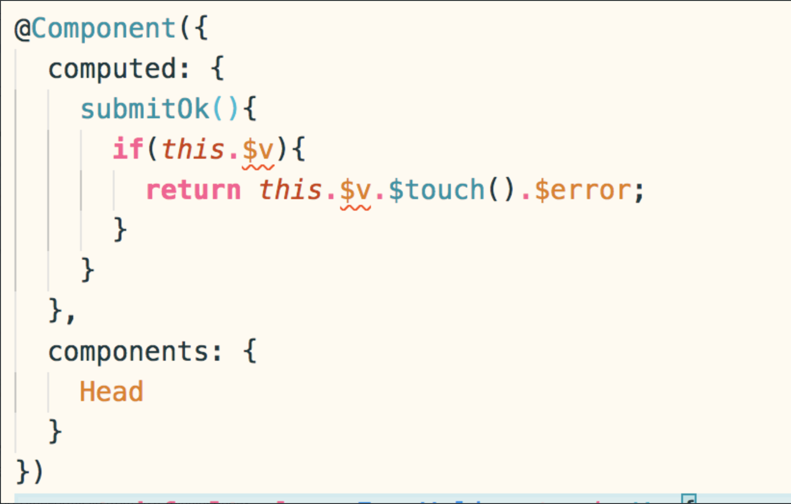
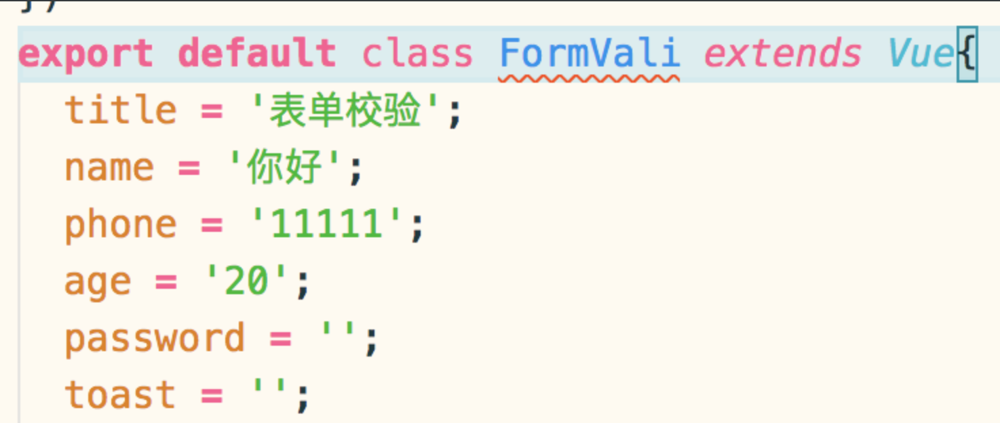
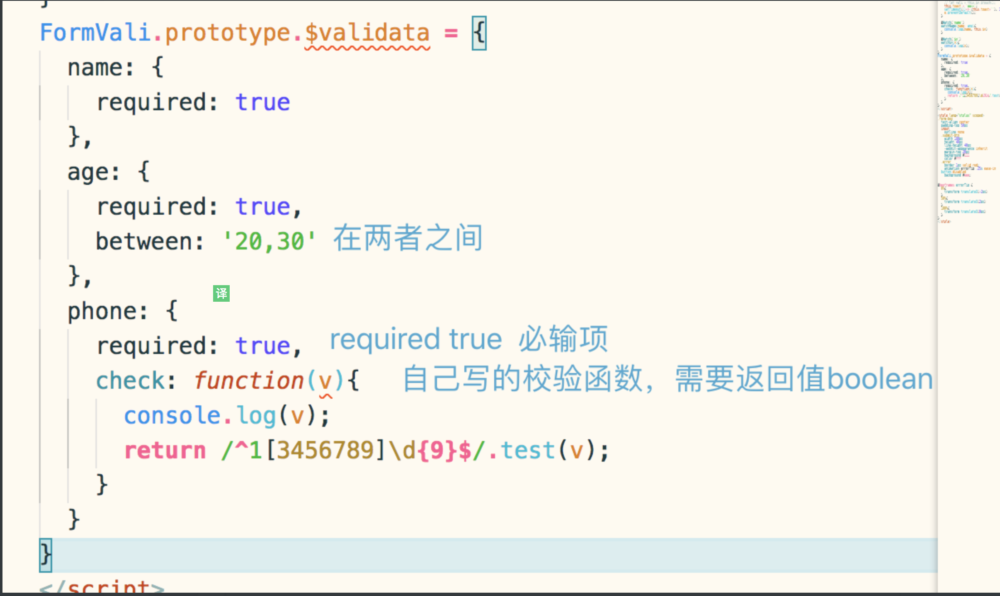
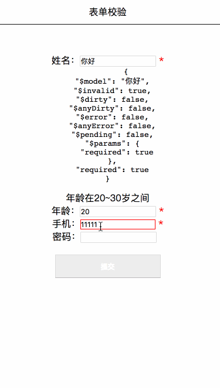

# vue-form-validata
vue 检验form表单 有效数据校验

---
> 在项目中遇到很多表单填写的业务，当时觉得每个有表单的页面都去写很多的校验方法很繁琐，也没有时间去研究下搞个插件，项目的测试阶段终于有时间可以去整理了，所以仿着vuelidate写了一个简单的校验插件

1. 项目搭建 parcel + vue + ts；
parcel支持ts转换，所以不需要额外去配置什么；

```
yarn install
```
安装项目全部依赖

2. 启动项目  
```
yarn start
```
然后浏览器打开
Server running at http://localhost:1234;

### vue 中ts的使用
> 在.vue文件中写ts 用到的是vue-property-decorator;具体用法参考GitHub
https://github.com/Microsoft/TypeScript-Vue-Starter  

  
  

**使用校验**  
1. import {VueFormVali} from './src/plugins/index'  
2. Vue.use(VueFormVali)  
3.   
4. 在input标签上v-model="$v.name.$model"自动校验值  
> $validata会映射校验的data值copy一份出来当做$v对象，可以拿到所有的校验  
5. 在input或者在有需要error提示的地方加上:class="{'error': $v.name.$error}"校验成功$error->false,失败->true;  
6. this.$v.$touch().$error; 校验表单所有项，所有的都校验通过$error为false，否则true  
7. this.$v['校验属性'].$touch()单独校验过个属性数据；  

---
效果展示  
